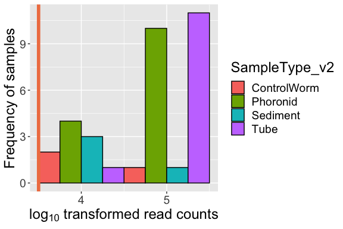
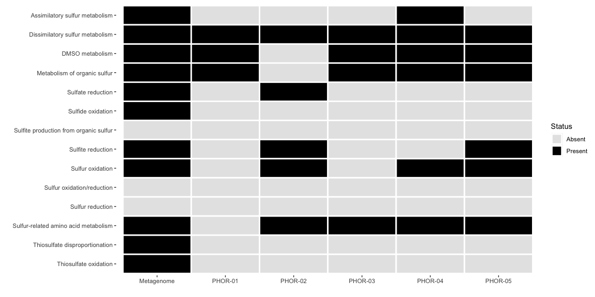

Phoronid Amplicon and Metagenomic R Analysis
================
Cassie Ettinger

ChatGPT 3.5 (<https://openai.com>) was asked to suggest improvements to
code comments. These suggestions were edited and incorporated as
appropriate to help streamline documentation for readability.

### Loading packages and setting up the analysis

First, load in the R packages that will be used and make note of their
versions.

``` r
# Load necessary libraries for the analysis
library(tidyverse)
library(vegan)
library(phyloseq)
library(RColorBrewer)
library(coin)
library(rmarkdown)
library(FSA)
library(reshape)
library(betapart)
library(dada2)
library(magrittr)
library(ShortRead)
library(ade4)
library(vroom)
library(corncob)
library(viridis)
library(microbiome)
library(patchwork)
library(decontam)
library(microbiome)
library(biobroom)
library(pairwiseAdonis)
library(phangorn)
library(DECIPHER)
library(ape)

# Load custom functions from 'misc_functions.R'
source("R scripts/misc_functions.R")

# Set random seed for reproducibility of random operations
set.seed(5311)

# Get R package references sink('test.bib') out <-
# sapply(names(sessionInfo()$otherPkgs),function(x)
# print(citation(x), style = 'Bibtex'))

# Print the session info, including computer version, R
# version, and package versions
sessionInfo()
```

    ## R version 4.3.0 (2023-04-21)
    ## Platform: x86_64-apple-darwin20 (64-bit)
    ## Running under: macOS Ventura 13.5.2
    ## 
    ## Matrix products: default
    ## BLAS:   /Library/Frameworks/R.framework/Versions/4.3-x86_64/Resources/lib/libRblas.0.dylib 
    ## LAPACK: /Library/Frameworks/R.framework/Versions/4.3-x86_64/Resources/lib/libRlapack.dylib;  LAPACK version 3.11.0
    ## 
    ## locale:
    ## [1] en_US.UTF-8/en_US.UTF-8/en_US.UTF-8/C/en_US.UTF-8/en_US.UTF-8
    ## 
    ## time zone: America/Los_Angeles
    ## tzcode source: internal
    ## 
    ## attached base packages:
    ## [1] parallel  stats4    stats     graphics  grDevices utils     datasets 
    ## [8] methods   base     
    ## 
    ## other attached packages:
    ##  [1] DECIPHER_2.28.0             RSQLite_2.3.1              
    ##  [3] phangorn_2.11.1             ape_5.7-1                  
    ##  [5] pairwiseAdonis_0.4.1        cluster_2.1.4              
    ##  [7] biobroom_1.32.0             broom_1.0.5                
    ##  [9] decontam_1.20.0             patchwork_1.1.2            
    ## [11] microbiome_1.22.0           viridis_0.6.4              
    ## [13] viridisLite_0.4.2           corncob_0.3.1              
    ## [15] vroom_1.6.3                 ade4_1.7-22                
    ## [17] ShortRead_1.58.0            GenomicAlignments_1.36.0   
    ## [19] SummarizedExperiment_1.30.2 Biobase_2.60.0             
    ## [21] MatrixGenerics_1.12.3       matrixStats_1.0.0          
    ## [23] Rsamtools_2.16.0            GenomicRanges_1.52.0       
    ## [25] Biostrings_2.68.1           GenomeInfoDb_1.36.1        
    ## [27] XVector_0.40.0              IRanges_2.34.1             
    ## [29] S4Vectors_0.38.1            BiocParallel_1.34.2        
    ## [31] BiocGenerics_0.46.0         magrittr_2.0.3             
    ## [33] dada2_1.28.0                Rcpp_1.0.11                
    ## [35] betapart_1.6                reshape_0.8.9              
    ## [37] FSA_0.9.4                   rmarkdown_2.23             
    ## [39] coin_1.4-2                  survival_3.5-5             
    ## [41] RColorBrewer_1.1-3          phyloseq_1.44.0            
    ## [43] vegan_2.6-4                 lattice_0.21-8             
    ## [45] permute_0.9-7               lubridate_1.9.2            
    ## [47] forcats_1.0.0               stringr_1.5.0              
    ## [49] dplyr_1.1.2                 purrr_1.0.1                
    ## [51] readr_2.1.4                 tidyr_1.3.0                
    ## [53] tibble_3.2.1                ggplot2_3.4.2              
    ## [55] tidyverse_2.0.0             knitr_1.43                 
    ## 
    ## loaded via a namespace (and not attached):
    ##  [1] libcoin_1.0-9           rstudioapi_0.15.0       jsonlite_1.8.7         
    ##  [4] TH.data_1.1-2           modeltools_0.2-23       zlibbioc_1.46.0        
    ##  [7] vctrs_0.6.3             multtest_2.56.0         memoise_2.0.1          
    ## [10] RCurl_1.98-1.12         htmltools_0.5.5         S4Arrays_1.0.5         
    ## [13] itertools_0.1-3         Rhdf5lib_1.22.0         rhdf5_2.44.0           
    ## [16] plyr_1.8.8              sandwich_3.0-2          cachem_1.0.8           
    ## [19] zoo_1.8-12              igraph_1.5.0.1          lifecycle_1.0.3        
    ## [22] minpack.lm_1.2-3        iterators_1.0.14        pkgconfig_2.0.3        
    ## [25] Matrix_1.6-0            R6_2.5.1                fastmap_1.1.1          
    ## [28] GenomeInfoDbData_1.2.10 magic_1.6-1             digest_0.6.33          
    ## [31] colorspace_2.1-0        hwriter_1.3.2.1         fansi_1.0.4            
    ## [34] timechange_0.2.0        abind_1.4-5             mgcv_1.9-0             
    ## [37] compiler_4.3.0          bit64_4.0.5             withr_2.5.0            
    ## [40] backports_1.4.1         DBI_1.1.3               MASS_7.3-60            
    ## [43] DelayedArray_0.26.7     biomformat_1.28.0       tools_4.3.0            
    ## [46] quadprog_1.5-8          glue_1.6.2              rcdd_1.5-2             
    ## [49] nlme_3.1-163            rhdf5filters_1.12.1     grid_4.3.0             
    ## [52] Rtsne_0.16              reshape2_1.4.4          generics_0.1.3         
    ## [55] snow_0.4-4              gtable_0.3.3            tzdb_0.4.0             
    ## [58] data.table_1.14.8       hms_1.1.3               utf8_1.2.3             
    ## [61] foreach_1.5.2           pillar_1.9.0            splines_4.3.0          
    ## [64] bit_4.0.5               deldir_1.0-9            tidyselect_1.2.0       
    ## [67] gridExtra_2.3           xfun_0.39               stringi_1.7.12         
    ## [70] yaml_2.3.7              evaluate_0.21           codetools_0.2-19       
    ## [73] interp_1.1-4            cli_3.6.1               RcppParallel_5.1.7     
    ## [76] geometry_0.4.7          munsell_0.5.0           doSNOW_1.0.20          
    ## [79] png_0.1-8               picante_1.8.2           blob_1.2.4             
    ## [82] latticeExtra_0.6-30     jpeg_0.1-10             bitops_1.0-7           
    ## [85] mvtnorm_1.2-2           scales_1.2.1            crayon_1.5.2           
    ## [88] rlang_1.1.1             fastmatch_1.1-3         multcomp_1.4-25        
    ## [91] formatR_1.14

## Remove primers from our sequences

We used the following primer sets from the Earth Microbiome Project:

### Earth Microbiome Project (EMP) 16S primers

<b>R1 forward primer 515F (Parada) 16S</b> GTGYCAGCMGCCGCGGTAA

<b>R2 reverse primer 806R (Apprill) </b> GGACTACNVGGGTWTCTAAT

### Before using R I have removed primers as follows:

``` bash

# Loop through the Read_ID.txt file, reading each line as new file prefix
for read in $(cat Read_ID.txt); 
do cutadapt -g ^GTGYCAGCMGCCGCGGTAA -G ^GGACTACNVGGGTWTCTAAT --match-read-wildcards -o $read'_R1.noprimers.fastq.gz' -p $read'_R2.noprimers.fastq.gz' $read'_R1.fastq.gz' $read'_R2.fastq.gz' >> log.txt; 
done
```

## Running DADA2

### DADA2 on 16S rRNA gene amplicons

``` r
# Set the file path to the directory containing
# primers-removed raw data
rd = "../data/primers_removed/"

# Set the file path to save the filtered files
fp = file.path("../data/filtered")

# Specify the path to the SILVA database for taxonomy
# assignment https://doi.org/10.15156/BIO/1280160
silva_db = "/Users/Cassie/Box Sync/Databases/silva/silva138.1/silva_nr99_v138.1_wSpecies_train_set.fa.gz"

# Inspect quality scores of the first six samples for
# forward reads
inspect_qual_F(rd)

# Inspect quality scores of the first six samples for
# reverse reads
inspect_qual_R(rd)

# Run DADA2 to denoise and dereplicate the sequences and
# return a list with six data frames: [1] errorF: Forward
# error estimates [2] errorR: Reverse error estimates [3]
# seqtab: Sequence table with the processed reads [4]
# chimera-filt seqtab: Sequence table after chimera
# filtering [5] taxonomy: Taxonomy assigned to the
# sequences [6] summary: Summary of read processing
# statistics Requires as input raw data path, filtered data
# path, F error estimate, R error estimate, F truncation
# length, R truncation length, taxonomy DB
bac_res <- run_dada2_16S(rd, fp, 2, 2, 190, 190, silva_db)

# Plot the error estimation for forward reads
plotErrors(bac_res[[1]], nominalQ = TRUE)

# Plot the error estimation for reverse reads
plotErrors(bac_res[[2]], nominalQ = TRUE)

# Write the sequence table as an R file
saveRDS(bac_res[[3]], "../results/processed_data/16S.seqtab.dd2.merged.rds")
# Write the chimera-filtered sequence table as an R file
saveRDS(bac_res[[4]], "../results/processed_data/16S.seqtab.dd2.merged_nochimera.rds")
# Save taxonomy as an R file
saveRDS(bac_res[[5]], "../results/processed_data/16S.seqtab.dd2.merged_nochimera_tax.rds")
# Save taxonomy as a csv file
write.csv(bac_res[[5]], "../results/processed_data/16S.seqtab.dd2.merged_nochimera_tax.csv")
# Save the summary information as a csv file
write.csv(bac_res[[6]], "../results/16S.summary_tab.csv")

# Inspect the distribution of final sequence lengths after
# chimera filtering
table(nchar(getSequences(bac_res[[4]])))

# Remove sequences that are too short or too long (keep
# only sequences with length between 250 and 258)
bac_seqtab_chim_lengthfilt <- bac_res[[4]][, nchar(colnames(bac_res[[4]])) %in%
    250:258]

# Inspect the distribution of sequence lengths after length
# filtering
table(nchar(getSequences(bac_seqtab_chim_lengthfilt)))

# Get the percentage of sequences that passed the chimera
# checking
sum(bac_seqtab_chim_lengthfilt)/sum(bac_res[[3]])  # 0.9878173

# Write the filtered sequence table as an R file
saveRDS(bac_seqtab_chim_lengthfilt, "../results/processed_data/16S.seqtab.dd2.merged_nochimera_lenfilt.rds")
```

### Setting up phyloseq objects

``` r
# Load the mapping file, which contains sample names and
# metadata about the samples, such as collection and
# processing information
mapping <- read.csv("../data/NRS_SG_Phoronid_Mapping_File.csv")

# Load the ASV (amplicon sequence variant) table and
# taxonomy table obtained from the DADA2 processing steps
seqtab.nochimera.16s <- readRDS("../results/processed_data/16S.seqtab.dd2.merged_nochimera_lenfilt.rds")
tax.16s <- readRDS("../results/processed_data/16S.seqtab.dd2.merged_nochimera_tax.rds")

# Extract sequences from the chimera-free ASV table and
# save them as a FASTA file
# uniquesToFasta(seqtab.nochimera.16s,
# '../results/processed_data/16s.unique_ASVs.fasta', ids =
# paste0('SV',
# seq(length(getSequences(seqtab.nochimera.16s)))))

# Relabel the ASVs from sequence-based names from sequence
# to '16S_SV#' format The 'SV#' format is used to uniquely
# identify each ASV.
seqtab_final.16s <- seqtab.nochimera.16s
colnames(seqtab_final.16s) <- paste0("SV", 1:ncol(seqtab_final.16s))

tax_final.16s <- tax.16s
rownames(tax_final.16s) <- paste0("SV", 1:nrow(tax_final.16s))
```

## Phylogeny

``` r
# Get DNA sequences from the chimera-removed ASV table
seqs <- getSequences(seqtab.nochimera.16s)

# Assign names to the sequences using the 'SV#' format
names(seqs) <- paste0("SV", 1:ncol(seqtab_final.16s))  # This propagates to the tip labels of the tree

# Align DNA sequences
alignment <- AlignSeqs(DNAStringSet(seqs), anchor = NA, verbose = FALSE)

# Turn alignment into a matrix
phangAlign <- phyDat(as(alignment, "matrix"), type = "DNA")

# Calculate maximum likelihood distances for the alignment
dm <- dist.ml(phangAlign)

# Build a neighbor-joining tree using the maximum
# likelihood distances The tree is inferred using a GTR+G+I
# (Generalized time-reversible with Gamma rate variation)
# model
treeNJ <- NJ(dm)  # Note, tip order != sequence order
fit = pml(treeNJ, data = phangAlign)
fitGTR <- update(fit, k = 4, inv = 0.2)
fitGTR <- optim.pml(fitGTR, model = "GTR", optInv = TRUE, optGamma = TRUE,
    rearrangement = "stochastic", control = pml.control(trace = 0))

# Save the fitted GTR tree as an RDS file
saveRDS(fitGTR, "../results/processed_data/seqtab2_tree.rds")

# Remove unnecessary objects from the environment
# (optional) rm(alignment); rm(fit); rm(phangAlign);
# rm(dm); rm(treeNJ); rm(seqs)

# Define the outgroup sequence (unclassified eukaryote) to
# root the tree
outgroupseq <- "SV5460"

# Read the fitted GTR tree from the previously saved RDS
# file
fitGTR <- readRDS("../results/processed_data/seqtab2_tree.rds")

# Root the tree using the defined outgroup sequence and
# resolve the root position
phyloseq.tree <- root(fitGTR$tree, outgroup = outgroupseq, resolve.root = TRUE)

# Save the rooted tree as an RDS file
saveRDS(phyloseq.tree, "../results/processed_data/Phor_seqtab2_tree_eukaryote_rooted.rds")
```

``` r
## Construct the phyloseq files

# Set the row names of the 'mapping' data frame to
# 'ZymoSampleID'
row.names(mapping) <- mapping$ZymoSampleID

mapping_file = sample_data(mapping)

asv_table.16s = otu_table(seqtab_final.16s, taxa_are_rows = FALSE)

taxa_table.16s = tax_table(tax_final.16s)

phyloseq.tree <- readRDS("../results/processed_data/Phor_seqtab2_tree_eukaryote_rooted.rds")

# Construct the phyloseq object 'ps.16s' by combining the
# ASV table, sample data, taxa table, and the rooted
# phylogenetic tree
ps.16s <- phyloseq(asv_table.16s, mapping_file, taxa_table.16s,
    phyloseq.tree)
ps.16s
```

    ## phyloseq-class experiment-level object
    ## otu_table()   OTU Table:         [ 8125 taxa and 48 samples ]
    ## sample_data() Sample Data:       [ 48 samples by 31 sample variables ]
    ## tax_table()   Taxonomy Table:    [ 8125 taxa by 7 taxonomic ranks ]
    ## phy_tree()    Phylogenetic Tree: [ 8125 tips and 8124 internal nodes ]

## Filtering the datasets

``` r
# Summary of the 'Kingdom' taxonomy column in the taxa
# table of 'ps.16s'
summary(as.factor(as.data.frame(tax_table(ps.16s))$Kingdom))
```

    ##   Archaea  Bacteria Eukaryota      NA's 
    ##       423      7697         2         3

``` r
# The output indicates that there are 2 'Eukaryota' and 3
# 'NA'.

# Create a new phyloseq object 'ps.16s_OP' by removing ASVs
# not assigned to 'Eukaryota' or 'NA'
ps.16s_OP <- subset_taxa(ps.16s, Kingdom != "Eukaryota")
ps.16s_OP <- subset_taxa(ps.16s_OP, Kingdom != "NA")

# Further remove ASVs assigned to 'Chloroplast' in the
# 'Order' taxonomy column and ASVs assigned to
# 'Mitochondria' in the 'Family' taxonomy column
ps.16s_OP <- subset_taxa(ps.16s_OP, Order != "Chloroplast")
ps.16s_OP <- subset_taxa(ps.16s_OP, Family != "Mitochondria")

ps.16s_OP
```

    ## phyloseq-class experiment-level object
    ## otu_table()   OTU Table:         [ 4408 taxa and 48 samples ]
    ## sample_data() Sample Data:       [ 48 samples by 31 sample variables ]
    ## tax_table()   Taxonomy Table:    [ 4408 taxa by 7 taxonomic ranks ]
    ## phy_tree()    Phylogenetic Tree: [ 4408 tips and 4407 internal nodes ]

``` r
# Create a new phyloseq object 'ps.16s_OP_nz' by removing
# samples with zero reads
ps.16s_OP_nz <- prune_samples(sample_sums(ps.16s_OP) > 0, ps.16s_OP)
ps.16s_OP_nz
```

    ## phyloseq-class experiment-level object
    ## otu_table()   OTU Table:         [ 4408 taxa and 48 samples ]
    ## sample_data() Sample Data:       [ 48 samples by 31 sample variables ]
    ## tax_table()   Taxonomy Table:    [ 4408 taxa by 7 taxonomic ranks ]
    ## phy_tree()    Phylogenetic Tree: [ 4408 tips and 4407 internal nodes ]

## Use decontam to remove contaminants

``` r
# Three kinds of negative controls: (1) kit control (no
# sample added) (2) ethanol (used to surface clean samples)
# (3) sterile water (used to surface clean samples)

# Create a new phyloseq object 'kit.16s' by removing other
# types of controls (positive and negative)
kit.16s <- subset_samples(ps.16s_OP_nz, SampleType != "Control_H20")
kit.16s <- subset_samples(kit.16s, SampleType != "Control_EtoH")
kit.16s <- subset_samples(kit.16s, SampleType != "Control_ZymoMockComm")

# Run decontamination analysis using a threshold of 0.5 and
# the control sample type 'Control_Kit'
contams.16s <- run_decontam_threshold(kit.16s, 0.5, "Control_Kit")

# Calculate the number of contaminants found by decontam
length(contams.16s[[1]])
```

    ## [1] 99

``` r
# Plot decontam results
contams.16s[[2]]
```

<!-- -->

``` r
# Create a new phyloseq object 'etoh.16s' by removing other
# types of controls (positive and negative)
etoh.16s <- subset_samples(ps.16s_OP_nz, SampleType != "Control_H20")
etoh.16s <- subset_samples(etoh.16s, SampleType != "Control_Kit")
etoh.16s <- subset_samples(etoh.16s, SampleType != "Control_ZymoMockComm")

# Run decontamination analysis using a threshold of 0.5 and
# the control sample type 'Control_EtoH'
contams.16s.etoh <- run_decontam_threshold(etoh.16s, 0.5, "Control_EtoH")

# Calculate the number of contaminants found by decontam
length(contams.16s.etoh[[1]])
```

    ## [1] 8

``` r
# Plot decontam results
contams.16s.etoh[[2]]
```

<!-- -->

``` r
# Create a new phyloseq object 'h20.16s' by removing other
# types of controls (positive and negative)
h20.16s <- subset_samples(ps.16s_OP_nz, SampleType != "Control_EtoH")
h20.16s <- subset_samples(h20.16s, SampleType != "Control_Kit")
h20.16s <- subset_samples(h20.16s, SampleType != "Control_ZymoMockComm")

# Run decontamination analysis using a threshold of 0.5 and
# the control sample type 'Control_H20'
contams.16s.h20 <- run_decontam_threshold(h20.16s, 0.5, "Control_H20")

# Calculate the number of contaminants found by decontam
length(contams.16s.h20[[1]])
```

    ## [1] 11

``` r
# Plot decontam results
contams.16s.h20[[2]]
```

<!-- -->

``` r
# Create a vector 'all_contams.16s' containing all unique
# contaminant ASVs from the three types of negative
# controls
all_contams.16s <- unique(append(contams.16s[[1]], append(contams.16s.etoh[[1]],
    contams.16s.h20[[1]])))

# Obtain a list of all ASVs and making a new list of all
# ASVs except those that are contaminants
all_taxa.16s <- taxa_names(ps.16s_OP_nz)
newtaxa.16s <- all_taxa.16s[!(all_taxa.16s %in% all_contams.16s)]

# Calculate the total number of unique contaminant ASVs
length(unique(all_contams.16s))
```

    ## [1] 113

``` r
# Create a new phyloseq object by pruning the taxa
# identified as contaminants
ps.16s_decontam <- prune_taxa(newtaxa.16s, ps.16s_OP_nz)

# Remove control samples from the phyloseq object
ps.16s_decontam_NC <- subset_samples(ps.16s_decontam, SampleType !=
    "Control_ZymoMockComm")
ps.16s_decontam_NC <- subset_samples(ps.16s_decontam_NC, SampleType !=
    "Control_EtoH")
ps.16s_decontam_NC <- subset_samples(ps.16s_decontam_NC, SampleType !=
    "Control_Kit")
ps.16s_decontam_NC <- subset_samples(ps.16s_decontam_NC, SampleType !=
    "Control_H20")

ps.16s_decontam_NC
```

    ## phyloseq-class experiment-level object
    ## otu_table()   OTU Table:         [ 4295 taxa and 33 samples ]
    ## sample_data() Sample Data:       [ 33 samples by 31 sample variables ]
    ## tax_table()   Taxonomy Table:    [ 4295 taxa by 7 taxonomic ranks ]
    ## phy_tree()    Phylogenetic Tree: [ 4295 tips and 4294 internal nodes ]

### Assessing rarefaction curves & library size

``` r
# Plot rarefaction curves using a step of 100 reads
p = ggrare(ps.16s_decontam_NC, step = 100, label = "SampleID",
    color = "SampleType_v2")
```

<!-- -->

``` r
# Draw a dashed vertical line at 10000 reads on the
# rarefaction plot
p + geom_vline(xintercept = 10000, linetype = "dashed")
```

<!-- -->

``` r
# Next look at library size Convert sample_data from
# 'ps.16s_decontam_NC' to a ggplot-friendly data frame 'df'
df <- as.data.frame(sample_data(ps.16s_decontam_NC))  # Put sample_data into a ggplot-friendly data.frame
df$LibrarySize <- sample_sums(ps.16s_decontam_NC)

# Sort based on the library size
df <- df[order(df$LibrarySize), ]
df$Index <- seq(nrow(df))

# Plot library size distribution with a dashed horizontal
# line at 10000 reads
ggplot(data = df, aes(x = Index, y = LibrarySize, color = SampleType_v2)) +
    geom_point() + geom_hline(yintercept = 10000, linetype = "dashed") +
    theme(text = element_text(size = 18))
```

<!-- -->

``` r
# Summary statistics of the library size
summary(df$LibrarySize)
```

    ##    Min. 1st Qu.  Median    Mean 3rd Qu.    Max. 
    ##   10042   30100   36766   35307   41442   58355

``` r
# Given that median is ~36000, first qu. is ~30000, minimum
# is ~10000 reads
hist(df$LibrarySize, breaks = 50)  #right skewed slightly
```

<!-- -->

``` r
# Plot a histogram of library size distribution with a
# vertical line at log10(1000) reads log10(1) = 0,
# log10(10) = 1, log10(100) = 2, log10(1000) = 3, so
# rarefying at 1000 line would be:
ggplot(data = df, aes(x = log10(LibrarySize), fill = SampleType_v2)) +
    geom_histogram(binwidth = 1, position = "dodge", col = "black") +
    theme(text = element_text(size = 18)) + ylab("Frequency of samples") +
    xlab(expression(paste("lo", g[10], " transformed read counts"))) +
    scale_x_continuous(breaks = c(0, 1, 2, 3, 4, 5)) + geom_vline(xintercept = 3.5,
    linetype = "solid", col = "#EF7F4FFF", size = 2)
```

<!-- -->

## Subsetting Data

``` r
# Define the rarefaction threshold as 10000 reads
rare_num_16s <- 10000

# Remove the sample (#525) which is a sample containing
# multiple phoronids
ps.16s_decontam_NC <- subset_samples(ps.16s_decontam_NC, CoreNumber !=
    "NA")

# Remove samples epresenting non-phoronid invertebrates
# (i.e., polychaete-like worms), which are not analyzed
# here
ps.16s_decontam_NC <- subset_samples(ps.16s_decontam_NC, SampleType_v2 !=
    "ControlWorm")
ps.16s_decontam_NC
```

    ## phyloseq-class experiment-level object
    ## otu_table()   OTU Table:         [ 4295 taxa and 29 samples ]
    ## sample_data() Sample Data:       [ 29 samples by 31 sample variables ]
    ## tax_table()   Taxonomy Table:    [ 4295 taxa by 7 taxonomic ranks ]
    ## phy_tree()    Phylogenetic Tree: [ 4295 tips and 4294 internal nodes ]

``` r
# Create a phyloseq object to include only samples with
# paired phoronids and tubes
ps.16s_decontam_NC_pairs <- subset_samples(ps.16s_decontam_NC,
    PAIR != "FALSE")

# Perform rarefaction
ps.16s_decontam_NC_rare <- rarefy_even_depth(ps.16s_decontam_NC,
    sample.size = rare_num_16s, rngseed = 5311, replace = FALSE)  #0 samples removed, 526 ASVs removed (3769 left)
```

    ## `set.seed(5311)` was used to initialize repeatable random subsampling.

    ## Please record this for your records so others can reproduce.

    ## Try `set.seed(5311); .Random.seed` for the full vector

    ## ...

    ## 526OTUs were removed because they are no longer 
    ## present in any sample after random subsampling

    ## ...

``` r
ps.16s_decontam_NC_pairs_rare <- rarefy_even_depth(ps.16s_decontam_NC_pairs,
    sample.size = rare_num_16s, rngseed = 5311, replace = FALSE)  #0 samples removed, 1370 ASVs removed (2925 left), 11 pairs
```

    ## `set.seed(5311)` was used to initialize repeatable random subsampling.

    ## Please record this for your records so others can reproduce.

    ## Try `set.seed(5311); .Random.seed` for the full vector

    ## ...

    ## 1370OTUs were removed because they are no longer 
    ## present in any sample after random subsampling

    ## ...

``` r
# Set up empty pvalue dataframes
alpha_pvals <- data.frame()
adonis_pvals <- data.frame()
disp_pvals <- data.frame()
```

## Alpha Diversity

### Phoronids, Tubes or Sediment

``` r
# Perform the statistical test for alpha diversity
# comparing diversity across sample types using the Shannon
# index
alpha.16s.st <- test_alpha_div(ps.16s_decontam_NC_rare, "SampleType_v2",
    "Shannon")

# alpha.16s.st[[1]] # sig

# Extract the p-value from the results
alpha.st <- data.frame(Data = "16S", Diversity = "Alpha", Metric = "Shannon",
    Category = "SampleType", pval = pvalue(alpha.16s.st[[1]])[1])

# Append the p-value information to our p-value dataframe
alpha_pvals <- bind_rows(alpha.st, alpha_pvals)

# Extract alpha diversity posthoc results and write the
# results to a CSV file.
alpha.16s.st[[2]]$res
```

    ##            Comparison          Z     P.unadj      P.adj
    ## 1 Phoronid - Sediment -2.6781479 0.007403052 0.01110458
    ## 2     Phoronid - Tube  0.1842998 0.853778302 0.85377830
    ## 3     Sediment - Tube  2.7800604 0.005434879 0.01630464

``` r
write.csv(alpha.16s.st[[2]]$res, "../results/alpha_st_posthoc.csv")
```

### Vegetation (Seagrass)

``` r
# Perform the statistical test for alpha diversity
# comparing diversity across vegetation status using the
# Shannon index
alpha.16s.sea <- test_alpha_div(ps.16s_decontam_NC_rare, "Seagrass",
    "Shannon")

# alpha.16s.sea[[1]] # not sig

# Extract the p-value from the results
alpha.sea <- data.frame(Data = "16S", Diversity = "Alpha", Metric = "Shannon",
    Category = "Vegetation", pval = pvalue(alpha.16s.sea[[1]])[1])

# Append the p-value information to our p-value dataframe
alpha_pvals <- bind_rows(alpha.sea, alpha_pvals)
```

### Core

``` r
# Perform the statistical test for alpha diversity
# comparing diversity across cores using the Shannon index
alpha.16s.core <- test_alpha_div(ps.16s_decontam_NC_rare, "CoreNumber",
    "Shannon")

# alpha.16s.core[[1]] # not sig

# Extract the p-value from the results
alpha.core <- data.frame(Data = "16S", Diversity = "Alpha", Metric = "Shannon",
    Category = "Core", pval = pvalue(alpha.16s.core[[1]])[1])

# Append the p-value information to our p-value dataframe
alpha_pvals <- bind_rows(alpha.core, alpha_pvals)
```

### Individuals

``` r
# Perform the statistical test for alpha diversity
# comparing diversity across paired samples using the
# Shannon index
alpha.16s.pair <- test_alpha_div(ps.16s_decontam_NC_pairs_rare,
    "PAIR", "Shannon")

# alpha.16s.pair[[1]] # not sig

# Extract the p-value from the results
alpha.core <- data.frame(Data = "16S", Diversity = "Alpha", Metric = "Shannon",
    Category = "Individual", pval = pvalue(alpha.16s.core[[1]])[1])

# Append the p-value information to our p-value dataframe
# and add pvalue correction
alpha_pvals <- bind_rows(alpha.core, alpha_pvals) %>%
    group_by(Data) %>%
    mutate(padj = p.adjust(pval, method = "BH"))

# Save p-values as csv file
write.csv(alpha_pvals, "../results/alpha_pvals.csv")
```

## Plotting Alpha Diversity

### Phoronids, Tubes or Sediment

``` r
# alpha.16s.st[[2]]$res

# Create a data containing annotations for the plot to be
# able to add statistical significance as letters
sample_annots <- data.frame(SampleType_v2 = c("Phoronid", "Tube",
    "Sediment"), Label = c("a", "a", "b"), Placement = c(5.35,
    5.64, 5.84))

# Create the boxplot of alpha diversity
plot.alpha.16s.st <- alpha.16s.st[[3]] %>%
    group_by(SampleType_v2) %>%
    mutate(SampleType_v2 = fct_relevel(SampleType_v2, c("Phoronid",
        "Tube", "Sediment"))) %>%
    ggplot(aes(x = SampleType_v2, y = Shannon, fill = SampleType_v2)) +
    geom_boxplot() + ylab("Shannon Diversity") + theme(text = element_text(size = 20)) +
    theme(legend.position = "none") + scale_fill_manual(values = c("#009E73",
    "#F0E442", "#0072B2")) + labs(x = "") + geom_jitter() + geom_text(data = sample_annots,
    aes(x = SampleType_v2, label = Label, y = Placement, size = 8,
        vjust = -0.7), col = "black", show.legend = F) + ylim(NA,
    6.5)

# Display the plot
plot.alpha.16s.st
```

<!-- -->

``` r
# Save the plot as PNG and PDF files
ggsave("../plots/alpha_sample.png", dpi = 300, device = "png",
    height = 6, width = 6, units = "in")
ggsave("../plots/alpha_sample.pdf", dpi = 300, device = "pdf",
    height = 6, width = 6, units = "in")
```

## Beta Diversity

### Phoronids, Tubes or Sediment

``` r
# Calculate beta diversity using the Weighted Unifrac
# metric
beta.16s.wu <- calculate_beta_div_unifrac(ps.16s_decontam_NC,
    "wunifrac", rare_num_16s, "PCoA")

# Fit a model using capscale to explore the importance of
# different factors in explaining the beta diversity.
# Determine the best model using 'ordiR2step' and
# 'ordistep'.
upr <- capscale(beta.16s.wu[[2]] ~ ., data = select(as(sample_data(ps.16s_decontam_NC),
    "data.frame"), "SampleType_v2", "Seagrass", "CoreNumber"))
lwr <- capscale(beta.16s.wu[[2]] ~ 1, data = as(sample_data(ps.16s_decontam_NC),
    "data.frame"))

model <- ordiR2step(lwr, upr, trace = 0)  # Best model using 'SampleType_v2' as predictor
model2 <- ordistep(lwr, upr, trace = 0)  # Best model using 'SampleType_v2' and 'Seagrass' as predictors

# Perform adonis tests to assess the significance of
# differences in beta diversity using 'best' model
beta.16s.st.wu.res <- adonis2(beta.16s.wu[[2]] ~ SampleType_v2 +
    Seagrass, as(sample_data(ps.16s_decontam_NC), "data.frame"),
    permutations = 9999, by = "margin")  #sig

# Extract p-values
beta.16s.st.wu.pvals <- get_beta_pvals(beta.16s.st.wu.res, 2)

# Perform pairwise adonis tests to compare beta diversity
# (no posthoc adonis test)
pw.beta.16s.st.wu <- pairwise.adonis(beta.16s.wu[[2]], as.factor(as(sample_data(ps.16s_decontam_NC),
    "data.frame")[, "SampleType_v2"]), perm = 9999, p.adjust.m = "BH")

write.csv(pw.beta.16s.st.wu, "../results/pw_beta_st_wu.csv")

# Convert resulting p-values into human-readable matrix
pw.beta.16s.st.wu.pretty <- pw.beta.16s.st.wu %>%
    separate(pairs, c("pair1", "pair2"), sep = " vs ") %>%
    select(pair1, pair2, p.adjusted) %>%
    pivot_wider(names_from = pair2, values_from = p.adjusted)

write.csv(pw.beta.16s.st.wu.pretty, "../results/pw_beta_st_wu_tab.csv")

# Perform pairwise adonis tests to compare beta diversity
# (no posthoc adonis test)
pw.beta.16s.sea.wu <- pairwise.adonis(beta.16s.wu[[2]], as.factor(as(sample_data(ps.16s_decontam_NC),
    "data.frame")[, "Seagrass"]), perm = 9999, p.adjust.m = "BH")

write.csv(pw.beta.16s.sea.wu, "../results/pw_beta_seagrass_wu.csv")

# Perform betadisper tests to test the dispersion of beta
# diversity
disp_dist <- betadisper(beta.16s.wu[[2]], as(sample_data(ps.16s_decontam_NC),
    "data.frame")[, "SampleType_v2"])

disp_dist.16s.st.wu <- permutest(disp_dist, permutations = 9999)
# not sig

# Extract p-values
disp_dist.16s.st.wu.pvals <- get_disp_pvals(disp_dist.16s.st.wu)

# Perform betadisper tests to test the dispersion of beta
# diversity
disp_dist <- betadisper(beta.16s.wu[[2]], as(sample_data(ps.16s_decontam_NC),
    "data.frame")[, "Seagrass"])
disp_dist.16s.wu.sea <- permutest(disp_dist, permutations = 9999)
# not sig

# Extract p-values
disp_dist.16s.wu.sea.pvals <- get_disp_pvals(disp_dist.16s.wu.sea)


# Save p-values and adjusted p-values for adonis tests
adonis.ST <- data.frame(Diversity = "Beta", Metric = "Weighted Unifrac",
    Category = c("SampleType_v2", "Seagrass"), Model = "SampleType_v2 + Seagrass",
    pval = c(beta.16s.st.wu.pvals[[1]][[1]], beta.16s.st.wu.pvals[[1]][[2]]),
    Fmod = c(beta.16s.st.wu.pvals[[2]][[1]], beta.16s.st.wu.pvals[[2]][[2]]),
    R2 = c(beta.16s.st.wu.pvals[[3]][[1]], beta.16s.st.wu.pvals[[3]][[2]]))

adonis_pvals <- bind_rows(adonis.ST, adonis_pvals) %>%
    mutate(padj = p.adjust(pval, method = "BH"))

write.csv(adonis_pvals, "../results/adonis_pvals.csv")

# Save p-values and adjusted p-values for dispersion tests
disp.ST <- data.frame(Diversity = "Dispersion", Metric = "Weighted Unifrac",
    Category = c("SampleType_v2", "Seagrass"), pval = c(disp_dist.16s.st.wu.pvals[[1]],
        disp_dist.16s.wu.sea.pvals[[1]]), Fmod = c(disp_dist.16s.st.wu.pvals[[2]],
        disp_dist.16s.wu.sea.pvals[[2]]))

disp_pvals <- bind_rows(disp.ST, disp_pvals) %>%
    mutate(padj = p.adjust(pval, method = "BH"))

write.csv(disp_pvals, "../results/dispersion_pvals.csv")
```

## Plotting Beta Diversity

### Phoronids, Tubes, etc

``` r
# Convert the 'SampleType_v2' column to a factor and set
# the levels for plotting.
sample_data(ps.16s_decontam_NC)$SampleType_v2 <- factor(sample_data(ps.16s_decontam_NC)$SampleType_v2,
    levels = c("Phoronid", "Tube", "Sediment"))

# Weighted UniFrac Plot
plot.beta.16s.st.wu = plot_ordination(physeq = ps.16s_decontam_NC,
    ordination = beta.16s.wu[[1]], shape = "SampleType_v2", color = "SampleType_v2") +
    geom_point(size = 3) + theme(text = element_text(size = 16)) +
    scale_color_manual(values = c("#009E73", "#F0E442", "#0072B2")) +
    xlab(paste0("PCoA 1: ", round(100 * beta.16s.wu[[1]]$values$Relative_eig[1],
        1), "% variance")) + ylab(paste0("PCoA 2: ", round(100 *
    beta.16s.wu[[1]]$values$Relative_eig[2], 1), "% variance")) +
    stat_ellipse() + guides(color = guide_legend(title = "Sample Type"),
    shape = guide_legend(title = "Sample Type"))

# Display the weighted UniFrac plot
plot.beta.16s.st.wu
```

<!-- -->

``` r
# Save the weighted UniFrac plot as PNG and PDF files
ggsave("../plots/beta_sample_wu.png", dpi = 300, device = "png",
    height = 6, width = 8, units = "in")
ggsave("../plots/beta_sample_wu.pdf", dpi = 300, device = "pdf",
    height = 6, width = 8, units = "in")
```

### Vegetation

``` r
# Weighted UniFrac Plot
plot.beta.16s.sea.wu = plot_ordination(physeq = ps.16s_decontam_NC,
    ordination = beta.16s.wu[[1]], shape = "Seagrass", color = "Seagrass") +
    geom_point(size = 3) + theme(text = element_text(size = 16)) +
    scale_color_manual(values = c("black", "grey")) + xlab(paste0("PCoA 1: ",
    round(100 * beta.16s.wu[[1]]$values$Relative_eig[1], 1),
    "% variance")) + ylab(paste0("PCoA 2: ", round(100 * beta.16s.wu[[1]]$values$Relative_eig[2],
    1), "% variance")) + stat_ellipse() + guides(color = guide_legend(title = "Vegetated"),
    shape = guide_legend(title = "Vegetated"))

# Display the weighted UniFrac plot
plot.beta.16s.sea.wu
```

<!-- -->

``` r
# Save the weighted UniFrac plot as PNG and PDF files
ggsave("../plots/beta_sea_wu.png", dpi = 300, device = "png",
    height = 6, width = 8, units = "in")
ggsave("../plots/beta_sea_wu.pdf", dpi = 300, device = "pdf",
    height = 6, width = 8, units = "in")
```

``` r
# Display the combined plots
plot.alpha.16s.st + plot.beta.16s.st.wu + plot_annotation(tag_levels = "A") +
    plot_layout(guides = "collect")
```

<!-- -->

``` r
# Save the plot as PNG and PDF files
ggsave("../plots/fig1.pdf", dpi = 300, device = "pdf", height = 5,
    width = 12, units = "in")
ggsave("../plots/fig1.png", dpi = 300, device = "png", height = 5,
    width = 12, units = "in")
```

## Plotting Relative Abundance

### Phoronids, Tubes, Sediment

``` r
# Transform sample counts to relative abundance
ps.16s.RA <- transform_sample_counts(ps.16s_decontam_NC_rare,
    function(x) x/sum(x))

# Group taxa at the Family level and calculate mean
# relative abundance
ps.16s.RA.gen <- tax_glom(ps.16s.RA, taxrank = "Family", NArm = FALSE)
df_ps.16s.RA.filt <- psmelt(ps.16s.RA.gen)
grouped.16s <- group_by(df_ps.16s.RA.filt, SampleType_v2, Phylum,
    Class, Order, Family)
avgs_grouped <- summarise(grouped.16s, mean = 100 * mean(Abundance),
    sd = 100 * sd(Abundance), se = 100 * se(Abundance))
```

    ## `summarise()` has grouped output by 'SampleType_v2', 'Phylum', 'Class',
    ## 'Order'. You can override using the `.groups` argument.

``` r
# Assign a 'Genus2' category to handle unclassified taxa
# and merge low-abundance taxa into 'Other' category for
# plotting
avgs_grouped.16s <- avgs_grouped %>%
    mutate(Genus2 = ifelse(is.na(Family), "Unknown", as.character(Family))) %>%
    mutate(Genus2 = ifelse(Genus2 == "Unknown", paste0("Unclassified ",
        as.character(Order)), as.character(Genus2))) %>%
    group_by(Genus2) %>%
    mutate(Genus2 = ifelse(sum(mean) < 5, "Other", as.character(Genus2))) %>%
    mutate(SampleType_v2 = fct_relevel(SampleType_v2, c("Phoronid",
        "Tube", "Sediment"))) %>%
    filter(Genus2 != "Other")

# Determine the order of taxa for better plotting
plot_order_by_abun <- avgs_grouped.16s %>%
    group_by(Genus2) %>%
    summarize(max_val = max(mean + se)) %>%
    arrange(desc(max_val))

# Set 'Genus2' as a factor and reorder it based on the
# calculated order
avgs_grouped.16s$Genus2 <- as.factor(avgs_grouped.16s$Genus2)
avgs_grouped.16s <- avgs_grouped.16s %>%
    mutate(Genus2 = fct_relevel(Genus2, plot_order_by_abun$Genus2))

# Create a bar plot of mean relative abundance per Family
# across different sample types
site_bar_ra.16s = ggplot(avgs_grouped.16s, aes(x = SampleType_v2,
    y = (mean), fill = Genus2)) + geom_bar(stat = "identity",
    position = "dodge") + theme_bw() + theme(text = element_text(size = 14)) +
    ylab("Mean Relative Abundance") + xlab("") + guides(fill = guide_legend(title = "Family")) +
    scale_fill_viridis_d(direction = -1, option = "D") + facet_wrap(~Genus2,
    scales = "free") + geom_errorbar(aes(ymin = (mean - se),
    ymax = (mean + se)), width = 0.4, position = position_dodge(0.9))

# Display the plot
site_bar_ra.16s
```

<!-- -->

``` r
# Save the plot as PNG and PDF files
ggsave("../plots/relative.png", dpi = 300, device = "png", height = 8,
    width = 14, units = "in")
ggsave("../plots/relative.pdf", dpi = 300, device = "pdf", height = 8,
    width = 14, units = "in")


# Create a split plot of mean relative abundance per Family
# for each sample type
site_bar_ra.split = ggplot(avgs_grouped.16s, aes(x = Genus2,
    y = (mean), fill = Genus2)) + geom_bar(stat = "identity",
    position = "dodge") + theme_bw() + theme(text = element_text(size = 14)) +
    ylab("Mean Relative Abundance") + xlab("") + guides(fill = guide_legend(title = "Family")) +
    scale_fill_viridis_d(direction = -1, option = "D") + facet_wrap(~SampleType_v2) +
    geom_errorbar(aes(ymin = (mean - se), ymax = (mean + se)),
        width = 0.4, position = position_dodge(0.9)) + theme(axis.text.x = element_text(angle = -70,
    hjust = 0, vjust = 0.5))

# Display the plot
site_bar_ra.split
```

<!-- -->

``` r
# Save the plot as PNG and PDF files
ggsave("../plots/relative_splitST.png", dpi = 300, device = "png",
    height = 6, width = 12, units = "in")
ggsave("../plots/relative_splitST.pdf", dpi = 300, device = "pdf",
    height = 6, width = 12, units = "in")
```

## Import metagenomics results

``` r
# Import results from NCBI/ete3
tax2name <- vroom("/Users/Cassie/Desktop/Phor_metaG/kraken_results/Species_taxonomy.txt")
```

    ## Rows: 8155 Columns: 5
    ## ── Column specification ────────────────────────────────────────────────────────
    ## Delimiter: "\t"
    ## chr (3): Sci.Name, Rank, Named Lineage
    ## dbl (1): # Taxid
    ## num (1): Taxid Lineage
    ## 
    ## ℹ Use `spec()` to retrieve the full column specification for this data.
    ## ℹ Specify the column types or set `show_col_types = FALSE` to quiet this message.

``` r
# Fix taxonomy levels as they are not perfect Modify the
# 'Named Lineage' column to clean up specific names
tax2name <- tax2name %>%
    mutate_at("Named Lineage", str_replace, "Bacteroidetes/Chlorobi group,",
        "") %>%
    mutate_at("Named Lineage", str_replace, "Terrabacteria group,",
        "") %>%
    mutate_at("Named Lineage", str_replace, "delta/epsilon subdivisions,",
        "") %>%
    mutate_at("Named Lineage", str_replace, "Cystobacterineae,",
        "") %>%
    mutate_at("Named Lineage", str_replace, "Sorangiineae,",
        "") %>%
    mutate_at("Named Lineage", str_replace, "Roseiflexineae,",
        "") %>%
    mutate_at("Named Lineage", str_replace, "Nannocystineae,",
        "") %>%
    mutate_at("Named Lineage", str_replace, "PVC group,", "") %>%
    mutate_at("Named Lineage", str_replace, "FCB group,", "") %>%
    mutate_at("Named Lineage", str_replace, "Cyanobacteria/Melainabacteria group,",
        "") %>%
    mutate_at("Named Lineage", str_replace, "Klebsiella/Raoultella group,",
        "") %>%
    mutate_at("Named Lineage", str_replace, "Chromobacterium group,",
        "") %>%
    mutate_at("Named Lineage", str_replace, "Erythrobacter/Porphyrobacter group,",
        "") %>%
    mutate_at("Named Lineage", str_replace, "Massilia group,",
        "") %>%
    mutate_at("Named Lineage", str_replace, "Sinorhizobium/Ensifer group,",
        "") %>%
    mutate_at("Named Lineage", str_replace, "Brucella/Ochrobactrum group,",
        "") %>%
    mutate_at("Named Lineage", str_replace, "Rhizobium/Agrobacterium group,",
        "") %>%
    mutate_at("Named Lineage", str_replace, "Azotobacter group,",
        "") %>%
    mutate_at("Named Lineage", str_replace, "Alteromonas/Salinimonas group,",
        "") %>%
    mutate_at("Named Lineage", str_replace, "Chryseobacterium group,",
        "") %>%
    mutate_at("Named Lineage", str_replace, "Chlamydia/Chlamydophila group,",
        "") %>%
    mutate_at("Named Lineage", str_replace, "CUG-Ser1 clade,",
        "") %>%
    mutate_at("Named Lineage", str_replace, "Candida/Lodderomyces clade,",
        "") %>%
    mutate_at("Named Lineage", str_replace, "Agaricomycetes incertae sedis,",
        "") %>%
    mutate_at("Named Lineage", str_replace, "saccharomyceta,",
        "") %>%
    mutate_at("Named Lineage", str_replace, "leotiomyceta,",
        "") %>%
    mutate_at("Named Lineage", str_replace, "Agaricomycetidae,",
        "") %>%
    mutate_at("Named Lineage", str_replace, "CUG-Ser2 clade,",
        "") %>%
    mutate_at("Named Lineage", str_replace, "dothideomyceta,",
        "") %>%
    mutate_at("Named Lineage", str_replace, "Pleosporomycetidae,",
        "") %>%
    mutate_at("Named Lineage", str_replace, "sordariomyceta,",
        "") %>%
    mutate_at("Named Lineage", str_replace, "Hypocreomycetidae,",
        "") %>%
    mutate_at("Named Lineage", str_replace, "Acarosporomycetidae,",
        "") %>%
    mutate_at("Named Lineage", str_replace, "Chaetothyriomycetidae,",
        "") %>%
    mutate_at("Named Lineage", str_replace, "Dothideomycetidae,",
        "") %>%
    mutate_at("Named Lineage", str_replace, "Eurotiomycetidae,",
        "") %>%
    mutate_at("Named Lineage", str_replace, "Mycocaliciomycetidae,",
        "") %>%
    mutate_at("Named Lineage", str_replace, "Phallomycetidae,",
        "") %>%
    mutate_at("Named Lineage", str_replace, "Pleosporomycetidae incertae sedis,",
        "") %>%
    mutate_at("Named Lineage", str_replace, "Sordariomycetidae,",
        "") %>%
    mutate_at("Named Lineage", str_replace, "Xylariomycetidae,",
        "") %>%
    mutate_at("Named Lineage", str_replace, "Phallomycetidae,",
        "") %>%
    mutate_at("Named Lineage", str_replace, "Dothideomycetes incertae sedis,",
        "Dothideomycetes incertae sedis,Dothideomycetes incertae sedis,") %>%
    mutate_at("Named Lineage", str_replace, "Apansporoblastina,",
        "Apansporoblastina,Apansporoblastina,Apansporoblastina,") %>%
    mutate_at("Named Lineage", str_replace, "Microsporidia incertae sedis,",
        "Microsporidia incertae sedis,Microsporidia incertae sedis,Microsporidia incertae sedis,Microsporidia incertae sedis,") %>%
    mutate_at("Named Lineage", str_replace, "Tubulinosematoidea,",
        "Tubulinosematoidea,Tubulinosematoidea,Tubulinosematoidea,") %>%
    mutate_at("Named Lineage", str_replace, "Pleosporineae,",
        "") %>%
    mutate_at("Named Lineage", str_replace, "Taphrinomycotina incertae sedis,",
        "Taphrinomycotina incertae sedis,Taphrinomycotina incertae sedis, Taphrinomycotina incertae sedis,") %>%
    mutate_at("Named Lineage", str_replace, "Mucorineae,", "") %>%
    mutate_at("Named Lineage", str_replace, "Fungiina,", "") %>%
    mutate_at("Named Lineage", str_replace, "Suillineae,", "") %>%
    mutate_at("Named Lineage", str_replace, "Pansporoblastina,",
        "Pansporoblastina,Pansporoblastina,Pansporoblastina,") %>%
    mutate_at("Named Lineage", str_replace, "TACK group,", "") %>%
    mutate_at("Named Lineage", str_replace, "Stenosarchaea group,",
        "") %>%
    mutate_at("Named Lineage", str_replace, "Methanomada group,",
        "") %>%
    mutate_at("Named Lineage", str_replace, "DPANN group,", "")


# Split taxonomy levels into separate columns Note this is
# imperfect at 'Species' level
tax2name.split <- tax2name %>%
    separate("Named Lineage", into = c("Root", "Domain", "Superkingdom",
        "Phylum", "Class", "Order", "Family", "Genus", "Species"),
        sep = ",")
```

    ## Warning: Expected 9 pieces. Additional pieces discarded in 4117 rows [18, 55, 70, 73,
    ## 75, 76, 78, 79, 80, 82, 83, 84, 89, 93, 97, 98, 111, 121, 122, 140, ...].

    ## Warning: Expected 9 pieces. Missing pieces filled with `NA` in 256 rows [72, 291, 292,
    ## 293, 294, 295, 296, 539, 541, 1224, 1277, 1286, 1287, 1336, 1446, 1826, 1849,
    ## 1901, 2074, 2140, ...].

``` r
# Import bracken counts data and taxonomic information
otu_kraken <- vroom("/Users/Cassie/Desktop/Phor_metaG/kraken_results/Species_bracken.tsv")
```

    ## Rows: 8632 Columns: 7
    ## ── Column specification ────────────────────────────────────────────────────────
    ## Delimiter: "\t"
    ## chr (2): name, taxonomy_lvl
    ## dbl (5): taxonomy_id, PHOR-511_S2.S.bracken_num, PHOR-511_S2.S.bracken_frac,...
    ## 
    ## ℹ Use `spec()` to retrieve the full column specification for this data.
    ## ℹ Specify the column types or set `show_col_types = FALSE` to quiet this message.

``` r
tax <- as.data.frame(otu_kraken[1:2])

otu_kraken <- otu_kraken[-c(2, 3, seq(5, length(otu_kraken),
    2))]

# Join the NCBI taxonomy strings with the Bracken TaxIDs
tax2 <- left_join(tax, tax2name.split, by = c(taxonomy_id = "# Taxid"))

tax2 <- tax2[-c(3, 4, 14)]
rownames(tax2) <- paste0("Species", 1:nrow(tax2))

# Clean the taxonomy labels, replacing NA values.
tax2 <- tax2 %>%
    mutate(Genus = ifelse(is.na(Genus), ifelse(is.na(Family),
        ifelse(is.na(Order), ifelse(is.na(Class), ifelse(is.na(Phylum),
            as.character(Superkingdom), as.character(Phylum)),
            as.character(Class)), as.character(Order)), as.character(Family)),
        as.character(Genus))) %>%
    mutate(Family = ifelse(is.na(Family), ifelse(is.na(Order),
        ifelse(is.na(Class), ifelse(is.na(Phylum), as.character(Superkingdom),
            as.character(Phylum)), as.character(Class)), as.character(Order)),
        as.character(Family))) %>%
    mutate(Order = ifelse(is.na(Order), ifelse(is.na(Class),
        ifelse(is.na(Phylum), as.character(Superkingdom), as.character(Phylum)),
        as.character(Class)), as.character(Order))) %>%
    mutate(Class = ifelse(is.na(Class), ifelse(is.na(Phylum),
        as.character(Superkingdom), as.character(Phylum)), as.character(Class))) %>%
    mutate(Phylum = ifelse(is.na(Phylum), as.character(Superkingdom),
        as.character(Phylum)))

tax3 <- tax2[-c(1:3)]

# Create phyloseq object from bracken counts and processed
# taxonomy data
otu_kraken <- as.data.frame(otu_kraken)

rownames(otu_kraken) <- paste0("Species", 1:nrow(otu_kraken))
otu_kraken <- otu_kraken[-c(1)]

otu_kraken_table <- otu_table(otu_kraken, taxa_are_rows = TRUE)
tax_table_kraken <- tax_table(as.matrix(tax3))

# Read and prepare metadata for phyloseq; metagenomic data
# is a subset of samples
metadata <- read.csv("../data/NRS_SG_Phoronid_Mapping_File.csv")
metadata_meta <- metadata %>%
    filter(SampleNumber %in% c(511, 512)) %>%
    mutate(MetaID = ifelse(SampleNumber == 511, "PHOR-511_S2.S.bracken_num",
        "PHOR-512_S3.S.bracken_num"))

meta <- sample_data(metadata_meta)
rownames(meta) <- meta$MetaID

# Create the final phyloseq object with bracken counts,
# taxonomy, and metadata
physeq_krak <- phyloseq(otu_kraken_table, tax_table_kraken, meta)

physeq_krak
```

    ## phyloseq-class experiment-level object
    ## otu_table()   OTU Table:         [ 8632 taxa and 2 samples ]
    ## sample_data() Sample Data:       [ 2 samples by 32 sample variables ]
    ## tax_table()   Taxonomy Table:    [ 8632 taxa by 8 taxonomic ranks ]

``` r
# Subset to only bacteria to align with 16S data
physeq_krak_BA <- subset_taxa(physeq_krak, Superkingdom == "Bacteria")
```

## Plotting relative abundance from metagenomes

``` r
# Transform sample counts to relative abundance for
# metagenomics data
k.ps.16s.RA <- transform_sample_counts(physeq_krak_BA, function(x) x/sum(x))

# Glom taxa at the Family level for metagenomics data (just
# like we did with 16S data)
k.ps.16s.RA.gen <- tax_glom(k.ps.16s.RA, taxrank = "Family",
    NArm = FALSE)
k.df_ps.16s.RA.filt <- psmelt(k.ps.16s.RA.gen)

# Calculate mean relative abundance for each Family
k.grouped.16s <- group_by(k.df_ps.16s.RA.filt, SampleType_v2,
    Phylum, Class, Order, Family)
k.avgs_grouped <- summarise(k.grouped.16s, mean = 100 * mean(Abundance))
```

    ## `summarise()` has grouped output by 'SampleType_v2', 'Phylum', 'Class',
    ## 'Order'. You can override using the `.groups` argument.

``` r
# Process data to group Families with low total abundance
# as 'Other' and reorder sample type levels for plotting
k.avgs_grouped.16s <- k.avgs_grouped %>%
    group_by(Family) %>%
    mutate(Genus2 = ifelse(sum(mean) < 5, "Other", as.character(Family))) %>%
    mutate(SampleType_v2 = fct_relevel(SampleType_v2, c("Phoronid",
        "Tube"))) %>%
    filter(Genus2 != "Other")

# Create a bar plot showing mean relative abundance of
# families
k.site_bar_ra.16s = ggplot(k.avgs_grouped.16s, aes(x = SampleType_v2,
    y = (mean), fill = Genus2)) + geom_bar(stat = "identity",
    position = "dodge") + theme_bw() + theme(text = element_text(size = 14)) +
    ylab("Mean Relative Abundance") + xlab("") + guides(fill = guide_legend(title = "Family")) +
    scale_fill_viridis_d(direction = -1, option = "D") + facet_wrap(~Genus2,
    scales = "free")

# Display the plot
k.site_bar_ra.16s
```

<!-- -->

``` r
# Save plot as PNG and PDF files
# ggsave('../plots/relative.png', dpi=300, device = 'png',
# height = 8, width= 14, units = 'in')
# ggsave('../plots/relative.pdf', dpi=300, device = 'pdf',
# height = 8, width= 14, units = 'in')

# Reorder Genus2 categories by abundance
k.plot_Order_by_abun <- k.avgs_grouped.16s %>%
    group_by(Genus2) %>%
    summarize(max_val = max(mean)) %>%
    arrange(desc(max_val))

k.avgs_grouped.16s$Genus2 <- as.factor(k.avgs_grouped.16s$Genus2)

k.avgs_grouped.16s <- k.avgs_grouped.16s %>%
    mutate(Genus2 = fct_relevel(Genus2, k.plot_Order_by_abun$Genus2))

# Create a bar plot showing mean relative abundance of
# families, ordered by abundance
k.site_bar_ra.split = ggplot(k.avgs_grouped.16s, aes(x = Genus2,
    y = (mean), fill = Genus2)) + geom_bar(stat = "identity",
    position = "dodge") + theme_bw() + theme(text = element_text(size = 14)) +
    ylab("Mean Relative Abundance") + xlab("") + guides(fill = guide_legend(title = "Family")) +
    scale_fill_viridis_d(direction = -1, option = "D") + facet_wrap(~SampleType_v2) +
    theme(axis.text.x = element_text(angle = -70, hjust = 0,
        vjust = 0.5))

# Display the plot
k.site_bar_ra.split
```

<!-- -->

``` r
# Save plot as PNG and PDF files
ggsave("plots/relative_metagenomics.png", dpi = 300, device = "png",
    height = 6, width = 12, units = "in")
ggsave("plots/relative_metagenomics.pdf", dpi = 300, device = "pdf",
    height = 6, width = 12, units = "in")
```

## Making a combined relative abundance plot comparing amplicons to metagenomes

``` r
# Taxonomic grouping at the Order level for 16S rRNA data
o.ps.16s.RA.gen <- tax_glom(ps.16s.RA, taxrank = "Order", NArm = FALSE)

# Melt, group and calculate mean, standard deviation, and
# standard error of relative abundance for each Order
o.df_ps.16s.RA.filt <- psmelt(o.ps.16s.RA.gen)
o.grouped.16s <- group_by(o.df_ps.16s.RA.filt, SampleType_v2,
    Phylum, Class, Order)
o.avgs_grouped <- summarise(o.grouped.16s, mean = 100 * mean(Abundance),
    sd = 100 * sd(Abundance), se = 100 * se(Abundance))
```

    ## `summarise()` has grouped output by 'SampleType_v2', 'Phylum', 'Class'. You can
    ## override using the `.groups` argument.

``` r
# Process data to handle missing or low-abundance Orders
# for 16S rRNA data
o.avgs_grouped.16s <- o.avgs_grouped %>%
    mutate(Order2 = ifelse(is.na(Order), "Unknown", as.character(Order))) %>%
    mutate(Order2 = ifelse(Order2 == "Unknown", paste0("Unclassified ",
        as.character(Order)), as.character(Order2))) %>%
    group_by(Order2) %>%
    mutate(Order2 = ifelse(sum(mean) < 5, "Other", as.character(Order2))) %>%
    mutate(SampleType_v2 = fct_relevel(SampleType_v2, c("Phoronid",
        "Tube", "Sediment")))  #%>%
# filter(Order2 != 'Other')

# Add a new column indicating the dataset type (will use to
# join with metagenomic data later)
o.avgs_grouped.16s$DataSet <- "16S rRNA"


# Repeat similar steps for metagenomics data Taxonomic
# grouping at the Order level for the metagenomics data
o.k.ps.16s.RA.gen <- tax_glom(k.ps.16s.RA, taxrank = "Order",
    NArm = FALSE)

# Melt, group and calculate mean of relative abundance for
# each Order
o.k.df_ps.16s.RA.filt <- psmelt(o.k.ps.16s.RA.gen)
o.k.grouped.16s <- group_by(o.k.df_ps.16s.RA.filt, SampleType_v2,
    Phylum, Class, Order)
o.k.avgs_grouped <- summarise(o.k.grouped.16s, mean = 100 * mean(Abundance))
```

    ## `summarise()` has grouped output by 'SampleType_v2', 'Phylum', 'Class'. You can
    ## override using the `.groups` argument.

``` r
# Process data to handle low-abundance Orders for
# metagenomics data
o.k.avgs_grouped.16s <- o.k.avgs_grouped %>%
    group_by(Order) %>%
    mutate(Order2 = ifelse(sum(mean) < 5, "Other", as.character(Order))) %>%
    mutate(SampleType_v2 = fct_relevel(SampleType_v2, c("Phoronid",
        "Tube")))  #%>%
# filter(Order2 != 'Other')

# Add a new column indicating the dataset type
o.k.avgs_grouped.16s$DataSet <- "Metagenomics"

# Combine the 16S rRNA and metagenomics relative abundance
# data
both.avg <- full_join(o.avgs_grouped.16s, o.k.avgs_grouped.16s)
```

    ## Joining with `by = join_by(SampleType_v2, Phylum, Class, Order, mean, Order2,
    ## DataSet)`

``` r
# Get a list of unique Order names across both datasets
fams_of_interest <- unique(both.avg$Order2)

# Filter the data to include only Orders of interest and
# remove low abundance Orders (i.e., 'Other' category)
both.avg.filt <- both.avg %>%
    mutate(Order2 = ifelse(Order %in% fams_of_interest[-c(1)],
        as.character(Order), as.character(Order2))) %>%
    filter(Order2 != "Other")

# combined both.avg <- both.avg %>% mutate(class2 =
# factor(class2, levels =
# c('Acidimicrobiia','Actinomycetia','Alphaproteobacteria',
# 'Bacilli','Bacteroidia','Betaproteobacteria','Clostridia','Cytophagia','Deltaproteobacteria','Desulfovibrionia',
# 'Epsilonproteobacteria','Flavobacteriia','Fusobacteriia','Gammaproteobacteria','Mollicutes','Nostocales','Planctomycetia','Sphingobacteriia','Spirochaetia','uncultured
# bacterium' , 'Other')))


# Create a bar plot showing the comparison of mean relative
# abundance of Orders between 16S rRNA and metagenomics
# datasets
both.site_bar_ra.split = ggplot(both.avg.filt, aes(x = Order2,
    y = (mean), fill = Order2)) + geom_bar(stat = "identity",
    position = "dodge") + theme_bw() + theme(text = element_text(size = 14)) +
    ylab("Mean Relative Abundance") + xlab("") + guides(fill = guide_legend(title = "Order")) +
    scale_fill_viridis_d(direction = -1, option = "D") + facet_wrap(DataSet ~
    SampleType_v2) + theme(axis.text.x = element_text(angle = -90,
    hjust = 0, vjust = 0)) + geom_errorbar(aes(ymin = (mean -
    se), ymax = (mean + se)), width = 0.4, position = position_dodge(0.9))

# Display the plot
both.site_bar_ra.split + theme(legend.position = "top")
```

<!-- -->

``` r
# Save the plot as PNG and PDF files
ggsave("plots/relative_comparison.png", dpi = 300, device = "png",
    height = 8, width = 14, units = "in")
ggsave("plots/relative_comparison.pdf", dpi = 300, device = "pdf",
    height = 8, width = 14, units = "in")
```

## Plotting sulfur cycling genes from MAGs and metagenome coassembly

``` r
# Load the results from METABOLIC
mag.sulf <- vroom("/Users/Cassie/Desktop/Phor_metaG/metabolic/metabolic_mags/mag_sulfur.txt")
```

    ## Rows: 98 Columns: 11
    ## ── Column specification ────────────────────────────────────────────────────────
    ## Delimiter: "\t"
    ## chr (5): Category, Function, FunctionBroad, Gene.abbreviation, Gene.name
    ## dbl (6): PHOR-05, PHOR-03, PHOR-02, PHOR-04, PHOR-01, PHOR-Coassembly
    ## 
    ## ℹ Use `spec()` to retrieve the full column specification for this data.
    ## ℹ Specify the column types or set `show_col_types = FALSE` to quiet this message.

``` r
# Convert the data to long format using pivot_longer,
# creating columns for 'MAG' and 'Count'
mag.sulf.long <- mag.sulf %>%
    pivot_longer(cols = starts_with("PHOR"), names_to = "MAG",
        values_to = "Count") %>%
    mutate(Status = ifelse(Count > 0, "Present", "Absent")) %>%
    mutate(Name = paste0(FunctionBroad, " (", Gene.abbreviation,
        ")")) %>%
    mutate(MAG = ifelse(MAG == "PHOR-Coassembly", "Metagenome",
        as.character(MAG)))

# mag.sulf.long %>% ggplot(aes(MAG, Name, fill= Status)) +
# geom_tile() + xlab('') + ylab('') +
# scale_fill_manual(values = c('grey90', 'black'))

# Plot showing the presence/absence of genes in each MAG
mag.sulf.long %>%
    ggplot(aes(MAG, Gene.abbreviation, fill = Status)) + geom_tile(color = "white",
    lwd = 0.5, linetype = 1) + facet_grid(FunctionBroad ~ .,
    scales = "free", space = "free", switch = "y") + xlab("") +
    ylab("") + scale_fill_manual(values = c("grey90", "black")) +
    theme(strip.text.y.left = element_text(angle = 0)) + theme(panel.grid = element_blank(),
    panel.background = element_rect(fill = "transparent"))
```

<!-- -->

``` r
# Save plot as PNG and PDF files
ggsave("plots/metabolic_sulfur_all.png", dpi = 300, device = "png",
    height = 13, width = 10, units = "in")
ggsave("plots/metabolic_sulfur_all.pdf", dpi = 300, device = "pdf",
    height = 13, width = 10, units = "in")

# Plot showing the presence/absence of genes related to
# 'Sulfur cycling' only
mag.sulf.long %>%
    filter(Category == "Sulfur cycling") %>%
    ggplot(aes(MAG, Name, fill = Status)) + geom_tile() + xlab("") +
    ylab("") + scale_fill_manual(values = c("grey90", "black"))
```

<!-- -->

``` r
# Plot showing the overall presence/absence of genes in
# each MAG based on 'FunctionBroad'
mag.sulf.long %>%
    group_by(MAG, FunctionBroad) %>%
    summarize(CountOverall = sum(Count)) %>%
    mutate(StatusOverall = ifelse(CountOverall > 0, "Present",
        "Absent")) %>%
    ggplot(aes(MAG, FunctionBroad, fill = StatusOverall)) + geom_tile(color = "white",
    lwd = 1, linetype = 1) + xlab("") + ylab("") + scale_fill_manual(values = c("grey90",
    "black")) + guides(fill = guide_legend(title = "Status")) +
    scale_y_discrete(limits = rev) + theme(panel.grid = element_blank(),
    panel.background = element_rect(fill = "transparent"))
```

    ## `summarise()` has grouped output by 'MAG'. You can override using the `.groups`
    ## argument.

<!-- -->

``` r
# Save plot as PNG and PDF files
ggsave("plots/metabolic_sulfur_process.png", dpi = 300, device = "png",
    height = 6, width = 10, units = "in")
ggsave("plots/metabolic_sulfur_process.pdf", dpi = 300, device = "pdf",
    height = 6, width = 10, units = "in")
```
